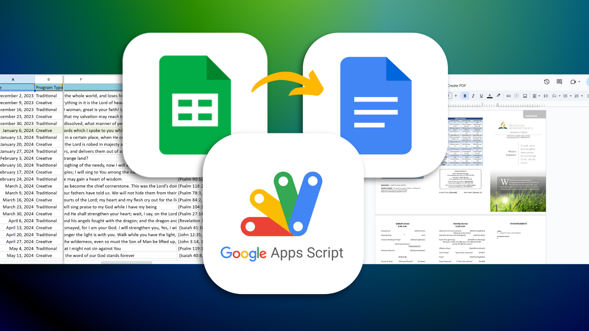

# Church Bulletin Autofill - Google Sheets Extension

The project was created using Google Apps Script (GAS) for the `ChurchBulletinSchedule` Google Sheet. It extracts data from a Google Sheet and uses it to automatically create the church bulletin for that week. 

Here's how it works:

1. It takes the data for one row (current week) in the Google Sheet
2. Determines the appropriate Google Doc template to use based on the `Program Type` column
3. Creates a copy of the chosen template
4. Fills in the new doc with the appropriate data from the Google Sheet row.

This project streamlines the approach to creating weekly church bulletins by allowing bulletin creators to do it at the push of a button.
   
## Repo Notes:
The `src` folder contains the script for the `Bulletin Autofill Template` GAS project.

The `docs_to_pdf` folder contains copied code from `Docs to PDF` GAS project. The Google Docs templates aren't using this code as of Dec. 17, 2024, as the church did not need it.
